# StarGAN
StarGAN: Unified Generative Adversarial Networks for Multi-Domain Image-to-Image Translation
The task of image-to-image translation is to change a particular aspect of a given image to another, e.g., changing the facial expression of a person from smiling to frowning or changing the similar looking animals like zebra to a horse or vice versa. Given training data from two different domains, these models learn to translate images from one domain to the other.

The term attribute denotes a meaningful feature inherent in an image such as hair color, gender or age, and attribute value as a particular value of an attribute, e.g., black/blond/brown for hair color or male/female for gender. We further denote domain as a set of images sharing the same attribute value. For example, images of women can represent one domain while those of men represent another.
(Cited from Paper)

Link to Gradio App: [https://huggingface.co/spaces/vipul2412/starGAN](url)

Link to the Paper: [https://arxiv.org/pdf/1711.09020](url)

## Dataset
The training has been done on Celeb Face Dataset. The dataset can be found on kaggle. Put the images inside the data folder and change the directory in the ipynb file respectively. I ran the notebook in different interval in kaggle so make sure you change the directories as per your requirements.

## Training
The Training has been done by selecting 5 classes - \['Black_Hair', 'Blonde_Hair', 'Brown_Hair', 'Male', 'Young'\] as well as 6 classes = \['Black_Hair', 'Pale_Skin', 'Brown_Hair', 'Male', 'Young','Eyeglasses',\]. You can change the attributes to change inside the Actual training cell by changing the arguments.

Just run the training ipynb notebook. The Actual training cell contains the code for printing the outputs(image translation into 5 classes) from 5 randomly input image from the current batch as well as it saves the model weights at regular intervals.

## Sample Outputs
Here are some sample outputs generated by the model for 5 classes \['Black_Hair', 'Blonde_Hair', 'Brown_Hair', 'Male', 'Young'\]:
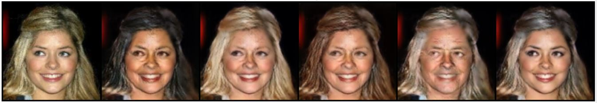
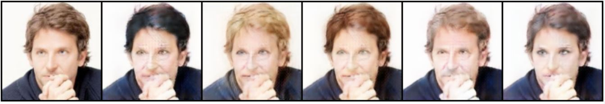
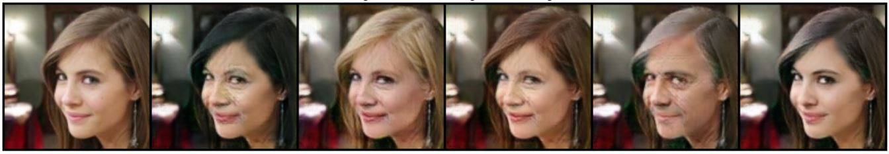
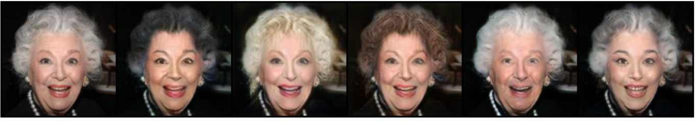
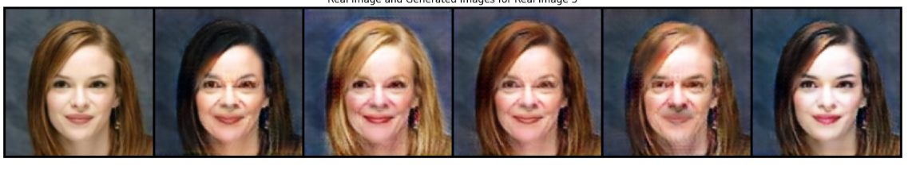

### Samples from model trained on 6 classes \['Black_Hair', 'Pale_Skin', 'Brown_Hair', 'Male', 'Young','Eyeglasses',\]

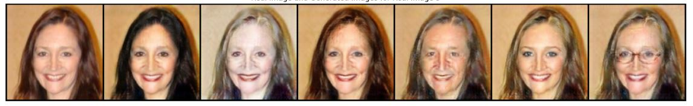
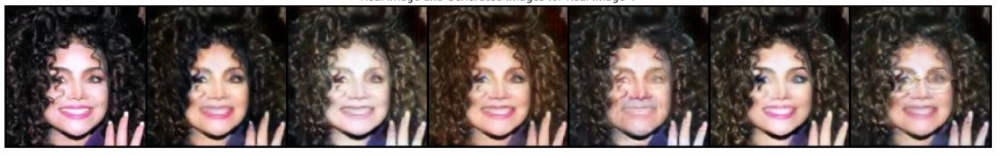
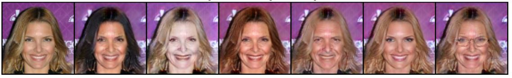
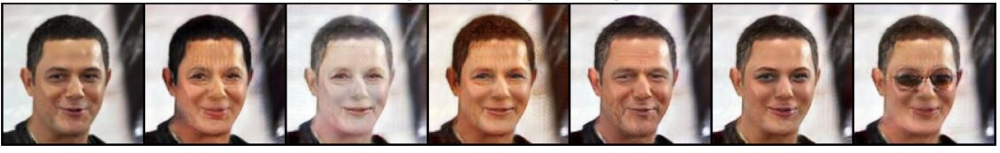
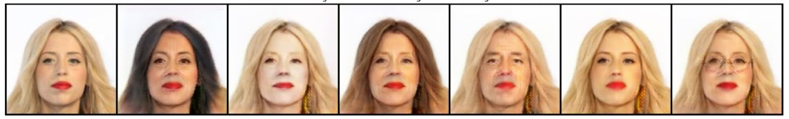
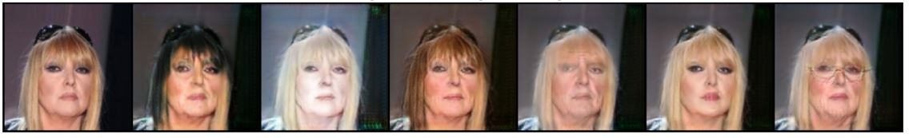
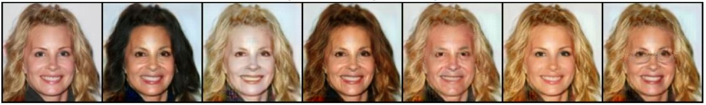
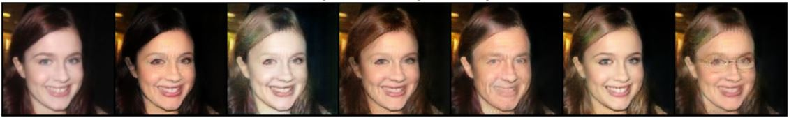
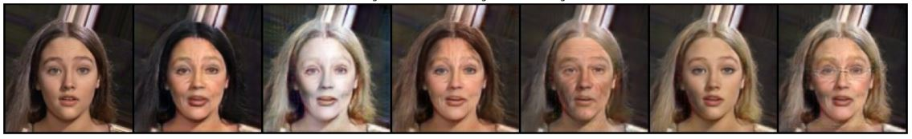

## Generating and testing
You can use Testing_celebA.ipynb file to randomly pick a face image from the dataset and look at the image translation into 5 classes - \['Black_Hair', 'Blonde_Hair', 'Brown_Hair', 'Male', 'Young'\]

## Download the pre-trained model weights (.pth file)
**Link (5 Classes):** [Download Here](https://drive.google.com/file/d/1e9zTyKw6xTrfmam1wtfjIXLd-HYhBeHj/view?usp=drive_link)

To use the pre-trained model you need to make necessary model and optimizer initializations, particulary a generator, discriminator and 2 Adam optimizers for each. (details can be seen in the python notebook).The structure of the `.pth` file is as follows:

```python
log_dict = {
    'iteration': i + 1,
    'model_G_state_dict': G.state_dict(),
    'model_D_state_dict': D.state_dict(),
    'optimizer_G_state_dict': g_optimizer.state_dict(),
    'optimizer_D_state_dict': d_optimizer.state_dict()
}
```

## Dependencies
* [Python 3.5+](https://www.continuum.io/downloads)
* [PyTorch 0.4.0](http://pytorch.org/)
* [torchvision](https://pypi.org/project/torchvision/) 
* [Pillow](https://pillow.readthedocs.io/en/stable/) 
* [tensorboardX](https://pypi.org/project/tensorboardX/) 
* [NumPy](https://numpy.org/) 
* [pandas](https://pandas.pydata.org/)
* [Matplotlib](https://matplotlib.org/) 
* [IPython](https://ipython.readthedocs.io/en/stable/)

## Citation
Original work is this [paper](https://arxiv.org/abs/1711.09020):
```
@InProceedings{StarGAN2018,
author = {Choi, Yunjey and Choi, Minje and Kim, Munyoung and Ha, Jung-Woo and Kim, Sunghun and Choo, Jaegul},
title = {StarGAN: Unified Generative Adversarial Networks for Multi-Domain Image-to-Image Translation},
booktitle = {The IEEE Conference on Computer Vision and Pattern Recognition (CVPR)},
month = {June},
year = {2018}
}
```


